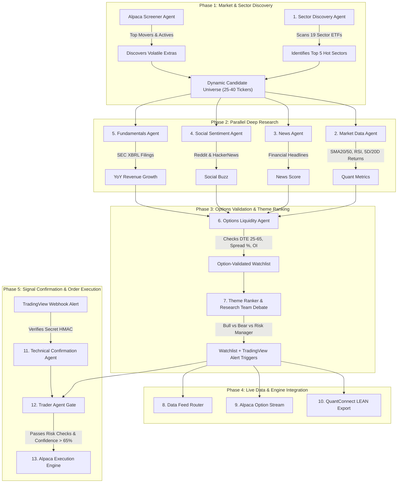

# Complete Pipeline Architecture & Agent Flow Guide

This guide explains every stage of the Research-First Options Trading Platform, how data flows through the system, where agents execute, and what is required to make the platform production-ready.

---

## 1. System Architecture & Activity Flow Diagram



---

## 2. Step-by-Step Breakdown of the 12 Pipeline Boxes

| # | Stage Name | What it Does | Inputs / Source | Output / Result | Agent Running |
|---|---|---|---|---|---|
| **1** | **Discovery** | Scans 19 sector ETFs (XLK, XLE, IBB, SMH, etc.) for 5D/20D price returns & volume expansion. Finds hot market themes. | Yahoo Finance ETF charts + Alpaca screeners | Top 5 active sectors + 25-40 dynamic tickers | `SectorDiscoveryAgent` |
| **2** | **Market** | Computes technical momentum metrics for each discovered ticker: 20D/50D Moving Averages, RSI, 5D/20D/60D returns, volume ratio. | Yahoo Finance price bars | `technical_score` (0–100) per ticker | `MarketDataAgent` |
| **3** | **Sources** | Gathers qualitative text & SEC corporate filings. Measures headline sentiment and YoY revenue/net income growth. | Yahoo News, Reddit RSS, HackerNews, SEC XBRL API | `news_score`, `social_score`, `fundamental_score` | `NewsAgent` + `SocialSentimentAgent` + `FundamentalsAgent` |
| **4** | **Research Team** | Runs a multi-perspective debate synthesizing bull arguments, bear risks, and portfolio risk regime (SPY/QQQ health). | Combined Market + Sources outputs | Structured Bull / Bear / Risk Manager debate | `ResearcherAgent` (Debate module) |
| **5** | **Options** | Validates options chain liquidity. Filters for contract DTE (25–65 days), tight bid/ask spread (<18%), and open interest (>100). | Cboe option chain data / Alpaca data | Selected OCC Contract (e.g. `PLTR231215C00020000`) | `OptionsValidationAgent` |
| **6** | **Themes** | Ranks active market baskets by combining sector momentum, volume surge, and narrative sentiment. | Active sector scores | Ranked themes with strength (0–100) | `ResearcherAgent` (_rank_themes) |
| **7** | **Watchlist** | Filters the top 8 candidates that passed both research & options liquidity checks. Generates custom TradingView alert rules. | Preliminary candidates + Options validation | Top 8 Watchlist with custom TV alert JSON | `ResearcherAgent` (_build_watchlist) |
| **8** | **Data Feeds** | Route-checks live stock and option quotes across configured providers (Alpaca, Finnhub, Alpha Vantage). | Provider API status | Quote provider health snapshot | `DataFeedRouter` |
| **9** | **Option Stream** | Establishes a live WebSocket stream to receive real-time bid/ask price updates for watchlist option contracts. | Alpaca WebSocket Feed | Live options quote stream (`bid`, `ask`, `last`) | `alpaca_option_stream` |
| **10** | **LEAN Engine** | Exports the option-validated universe into QuantConnect LEAN format (`universe.json`) for local backtesting & dry-running. | Watchlist candidates | `lean/universe.json` export | `lean_adapter.py` |
| **11** | **TradingView** | Listens on `/webhook/tradingview` for incoming indicator alerts. Verifies the secret token and matches alert against watchlist bias. | TradingView Webhook HTTP POST | Verified signal confirmation (`confirmed` / `rejected`) | `TechnicalConfirmationAgent` |
| **12** | **Decision Gate & Execution** | Evaluates confirmed signals against account buying power, option premium caps, and risk rules. Places paper/live orders via Alpaca. | Confirmed signal + Risk rules | Filled Alpaca order or paper plan log | `TraderAgent` + `alpaca_service` |

---

## 3. Agent Architecture: Who Runs Where?

Total Agents in System: **8 Specialized Agents**

### Background Research Agents (Run automatically or on demand)
1. **`SectorDiscoveryAgent`**: Discovers hot sectors & movers (Phase 1).
2. **`AlpacaDiscoveryAgent`**: Queries Alpaca market movers screener (Phase 1).
3. **`MarketDataAgent`**: Fetches technical chart bars & indicators (Phase 2).
4. **`NewsAgent`**: Pulls financial news headlines (Phase 2).
5. **`SocialSentimentAgent`**: Monitors Reddit & HackerNews discussions (Phase 2).
6. **`FundamentalsAgent`**: Queries SEC company facts CIK database (Phase 2).
7. **`OptionsValidationAgent`**: Checks option chain liquidity & DTE filters (Phase 3).

### Signal & Execution Agents (Run when a TradingView alert arrives)
8. **`TechnicalConfirmationAgent`**: Verifies HMAC secret & technical signal alignment.
9. **`TraderAgent`**: Runs final risk gate checks (premium cap, spread, market regime) and submits orders.

---

## 4. Production Readiness Roadmap: What is Needed When?

```
┌────────────────────────────────────────────────────────────────────────────┐
│                        PRODUCTION READINESS PHASES                          │
├──────────────────────────┬───────────────────────┬─────────────────────────┤
│ Phase 1: Current (Done)  │ Phase 2: AI Reasoning │ Phase 3: Live Trading   │
├──────────────────────────┼───────────────────────┼─────────────────────────┤
│ • Dynamic Discovery      │ • Replace mock LLM    │ • Set ALPACA_TRADING=   │
│ • Quant Market Filters   │   with OmniRoute API  │   true                  │
│ • Options Chain Check    │ • LLM Bull/Bear       │ • Cloud HTTPS Webhook   │
│ • TV Webhook Receiver    │   Debate Synthesis    │   (ngrok / AWS / VPS)   │
│ • LEAN Docker Export     │ • LLM Risk Manager    │ • Live Option Stream    │
└──────────────────────────┴───────────────────────┴─────────────────────────┘
```

### Critical Checklist for Production Deployment:

1. **HTTPS Webhook URL (Required for TradingView)**:
   - TradingView cannot send webhooks to `http://127.0.0.1:8080`.
   - Production requires exposing `/webhook/tradingview` over HTTPS using a domain or tool like `ngrok`, Cloudflare Tunnel, or deploying to a VPS (AWS / DigitalOcean).

2. **Secret Key Verification (`TRADINGVIEW_WEBHOOK_SECRET`)**:
   - Set a strong secret in `.env` and include it in your TradingView alert JSON payload to block unauthorized requests.

3. **LLM Integration via OmniRoute**:
   - Plug in your OmniRoute / OpenRouter API keys to enable LLM-powered Bull/Bear debates and final decision reasoning.

4. **Alpaca Trading Toggle (`ALPACA_TRADING_ENABLED`)**:
   - Currently, orders are generated as **"test plans"**. Set `ALPACA_TRADING_ENABLED=true` in `.env` when ready to place real paper/live trades.
